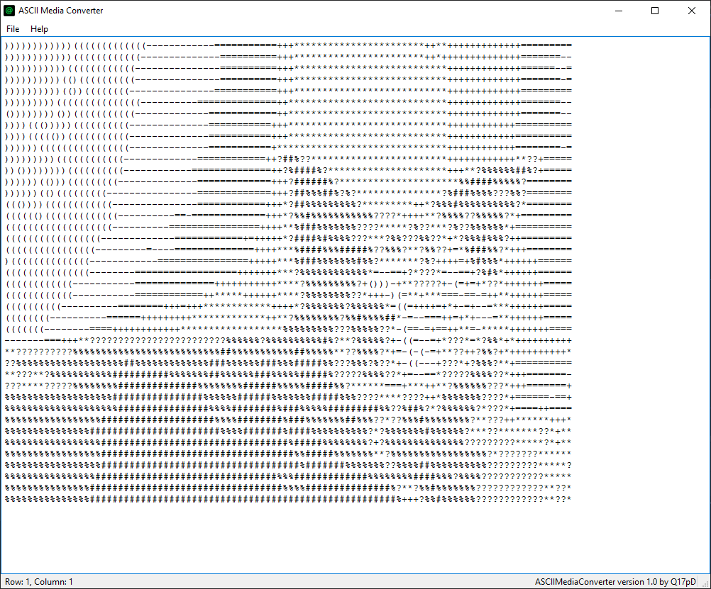

<h1 align="center">
   
  
   
  ASCII Media Converter
   
</h1>

A simple image to ASCII converter written on Python

  
  

Maybe i will also add video to ASCII convertation mode

## changelog
#### v1.0